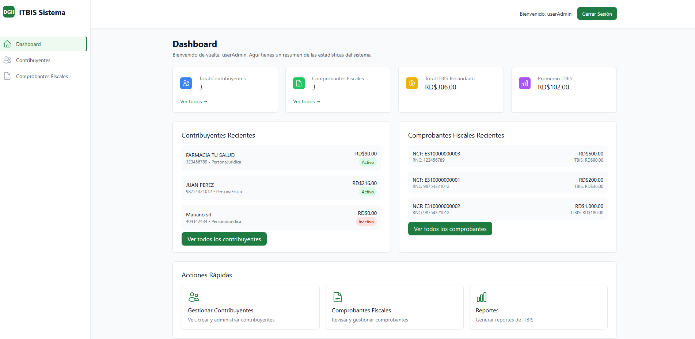
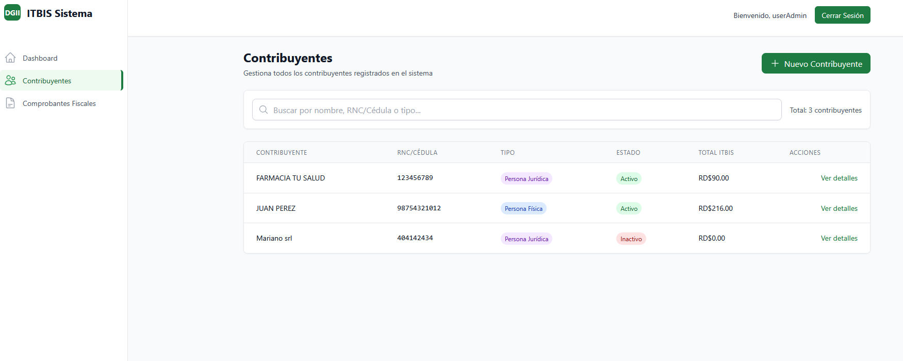
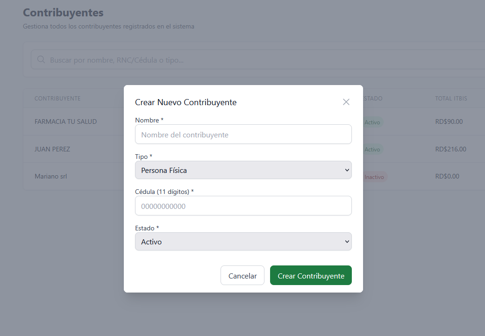
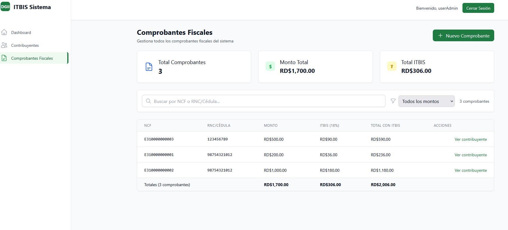
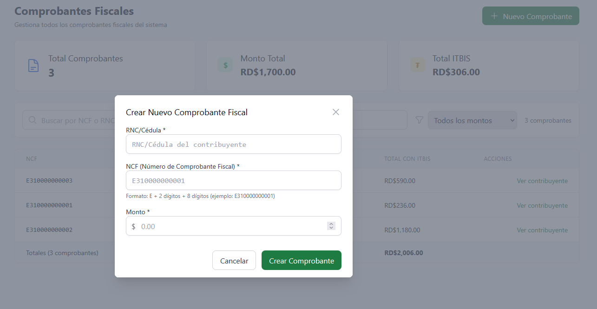
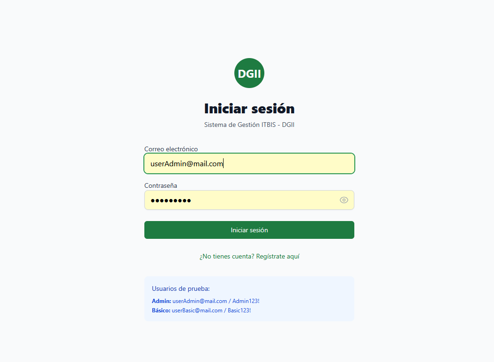
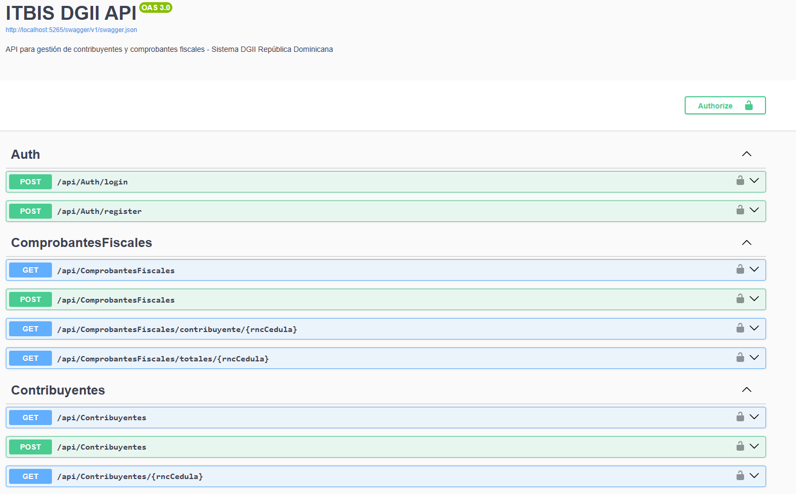

# 🏛️ Sistema ITBIS DGII

Sistema completo de gestión de contribuyentes y comprobantes fiscales para la Dirección General de Impuestos Internos (DGII) de República Dominicana.

## 📸 Vista Previa del Sistema
🖥️ Dashboard Principal
<div align="center">
  
  <p><em>Panel principal con estadísticas en tiempo real</em></p>
</div>
👥 Gestión de Contribuyentes
<div align="center">
  
  
  
  <p><em>Interfaz para gestionar contribuyentes</em></p>
</div>
📄 Comprobantes Fiscales
<div align="center">
  
  
  <p><em>Creación de comprobantes fiscales con cálculo automático de ITBIS</em></p>
</div>
🔐 Sistema de Autenticación
<div align="center">
  
  <p><em>Login seguro con JWT authentication</em></p>
</div>

🚀 Web API
<div align="center">
  
  <p><em>Web API .Net 8, Clean Architecture</em></p>
</div>

## 📋 Tabla de Contenidos

- [Características](#-características)
- [Tecnologías](#-tecnologías)
- [Arquitectura](#-arquitectura)
- [Estructura del Proyecto](#-estructura-del-proyecto)
- [Instalación y Configuración](#-instalación-y-configuración)
- [Uso con Docker](#-uso-con-docker)
- [Desarrollo Local](#-desarrollo-local)
- [API Endpoints](#-api-endpoints)
- [Testing](#-testing)
- [Contribución](#-contribución)

## ✨ Características

- 👥 **Gestión de Contribuyentes**: Registro y administración de personas físicas y jurídicas
- 📄 **Comprobantes Fiscales**: Creación y seguimiento de NCF (Números de Comprobante Fiscal)
- 💰 **Cálculo ITBIS**: Cálculo automático del 18% de ITBIS
- 🔐 **Autenticación JWT**: Sistema seguro de login y registro
- 📊 **Dashboard Interactivo**: Visualización de estadísticas y métricas
- 🎨 **Interfaz Moderna**: UI responsive con Tailwind CSS
- 🚀 **API RESTful**: Backend con Clean Architecture
- 🐳 **Docker Ready**: Despliegue containerizado completo

## 🛠️ Tecnologías

### Backend (.NET 8)
- **Framework**: ASP.NET Core 8.0
- **Arquitectura**: Clean Architecture con CQRS
- **ORM**: Entity Framework Core
- **Base de Datos**: SQL Server 2022
- **Autenticación**: JWT Bearer + ASP.NET Identity
- **Patrones**: 
  - Repository Pattern
  - Unit of Work
  - Specification Pattern
  - Mediator (MediatR)
- **Validaciones**: FluentValidation
- **Mapeo**: AutoMapper
- **Testing**: xUnit, Moq, FluentAssertions

### Frontend (React + Vite)
- **Framework**: React 18
- **Build Tool**: Vite
- **Styling**: Tailwind CSS
- **Routing**: React Router DOM
- **HTTP Client**: Axios
- **State Management**: React Context + useState
- **Notificaciones**: React Hot Toast
- **Iconos**: Heroicons React

### DevOps & Tools
- **Containerización**: Docker + Docker Compose
- **Web Server**: Nginx (Producción)
- **Proxy Reverso**: Configurado para SPA
- **Documentación**: Swagger/OpenAPI

## 🏗️ Arquitectura

El proyecto sigue los principios de **Clean Architecture** dividida en capas:

```
┌─────────────────┐
│   Presentation  │  ← API Controllers, React Frontend
├─────────────────┤
│   Application   │  ← Use Cases, Commands, Queries, DTOs
├─────────────────┤
│     Domain      │  ← Entities, Enums, Business Logic
├─────────────────┤
│ Infrastructure  │  ← Data Access, External Services
└─────────────────┘
```

## 📁 Estructura del Proyecto

```
ItbisDgii/
├── 📁 src/
│   ├── 📁 Core/
│   │   ├── 📂 ItbisDgii.Domain/           # Entidades de dominio y lógica de negocio
│   │   └── 📂 ItbisDgii.Application/      # Casos de uso, Commands, Queries, DTOs
│   ├── 📁 Infrastructure/
│   │   └── 📂 ItbisDgii.Infrastructure/   # Acceso a datos, servicios externos
│   └── 📁 Presentation/
│       └── 📂 ItbisDgii.API/              # Controllers y configuración API
├── 📁 tests/
│   └── 📂 ItbisDgii.Tests/                # Pruebas unitarias e integración
├── 📁 itbis-dgii-frontend/               # Aplicación React
│   ├── 📁 src/
│   │   ├── 📁 components/                 # Componentes reutilizables
│   │   ├── 📁 pages/                      # Páginas de la aplicación
│   │   ├── 📁 context/                    # Context API para estado global
│   │   └── 📁 services/                   # Servicios HTTP
│   └── 📁 public/                         # Archivos estáticos
├── 🐳 docker-compose.yml                 # Configuración completa
├── 🐳 docker-compose.dev.yml             # Solo base de datos para desarrollo
└── 📖 README.md                          # Este archivo
```

## 🚀 Instalación y Configuración

### Prerrequisitos

- [Docker](https://www.docker.com/get-started) y Docker Compose
- [.NET 8 SDK](https://dotnet.microsoft.com/download/dotnet/8.0) (para desarrollo local)
- [Node.js 18+](https://nodejs.org/) (para desarrollo local)
- [SQL Server](https://www.microsoft.com/sql-server) o Docker

## 🐳 Uso con Docker

### Opción 1: Despliegue Completo (Recomendado)

```bash
# Clonar el repositorio
git clone https://github.com/tu-usuario/itbis-dgii.git
cd itbis-dgii

# Ejecutar todos los servicios
docker-compose up -d

# Ver logs en tiempo real
docker-compose logs -f
```

**Servicios disponibles:**
- 🌐 Frontend: http://localhost:3000
- 🚀 API: http://localhost:5265
- 📊 Swagger: http://localhost:5265/swagger
- 🗄️ SQL Server: localhost:1433

### Opción 2: Desarrollo con Docker (Base de datos únicamente)

```bash
# Solo SQL Server para desarrollo local
docker-compose -f docker-compose.dev.yml up -d
```

## 💻 Desarrollo Local

### Backend (.NET)

```bash
cd ItbisDgii.API

# Restaurar paquetes
dotnet restore

# Aplicar migraciones
dotnet ef database update --project ../ItbisDgii.Infrastructure

# Ejecutar API
dotnet run
```

### Frontend (React)

```bash
cd itbis-dgii-frontend

# Instalar dependencias
npm install

# Modo desarrollo
npm run dev

# Build para producción
npm run build
```

## 🔧 Variables de Entorno

### Backend (appsettings.json)
```json
{
  "ConnectionStrings": {
    "DefaultConnection": "Server=localhost;Database=DbItbisDgii;Trusted_Connection=true;",
    "IdentityConnection": "Server=localhost;Database=IdentityItbisDgii;Trusted_Connection=true;"
  },
  "JWTSettings": {
    "Key": "tu-clave-secreta-jwt",
    "Issuer": "ITBISAppIssuer",
    "Audience": "ITBISAppAudience",
    "DurationInMinutes": 30
  }
}
```

### Frontend (.env)
```bash
VITE_API_URL=http://localhost:5265/api
VITE_APP_NAME=ITBIS DGII Sistema
```

## 🔗 API Endpoints

### Autenticación
- `POST /api/auth/login` - Iniciar sesión
- `POST /api/auth/register` - Registrar usuario

### Contribuyentes
- `GET /api/contribuyentes` - Listar contribuyentes
- `GET /api/contribuyentes/{rncCedula}` - Obtener contribuyente
- `POST /api/contribuyentes` - Crear contribuyente

### Comprobantes Fiscales
- `GET /api/comprobantesfiscales` - Listar comprobantes
- `GET /api/comprobantesfiscales/contribuyente/{rncCedula}` - Por contribuyente
- `GET /api/comprobantesfiscales/totales/{rncCedula}` - Total ITBIS
- `POST /api/comprobantesfiscales` - Crear comprobante

## 👤 Usuarios de Prueba

```bash
# Usuario Administrador
Email: userAdmin@mail.com
Password: Admin123!

# Usuario Básico
Email: userBasic@mail.com
Password: Basic123!
```

## 🧪 Testing

```bash
# Ejecutar todas las pruebas
dotnet test

# Con cobertura de código
dotnet test --collect:"XPlat Code Coverage"

# Pruebas específicas
dotnet test --filter "ClassName"
```

## 📝 Comandos Útiles

### Docker
```bash
# Reconstruir contenedores
docker-compose up --build

# Ver logs específicos
docker-compose logs api
docker-compose logs frontend

# Limpiar volúmenes
docker-compose down -v

# Acceder al contenedor
docker exec -it itbis-api bash
```

### Base de Datos
```bash
# Crear nueva migración
dotnet ef migrations add NombreMigracion --project ItbisDgii.Infrastructure

# Actualizar base de datos
dotnet ef database update --project ItbisDgii.Infrastructure

# Eliminar base de datos
dotnet ef database drop --project ItbisDgii.Infrastructure
```


